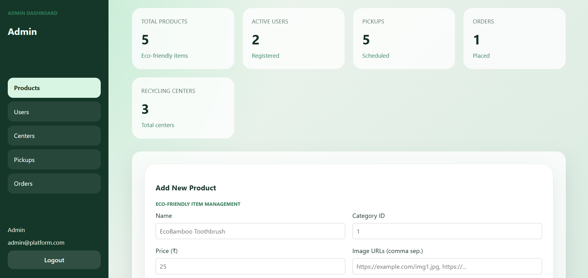

# ♻️ Sustainability Connect - Admin Dashboard

Modern **Admin Module** for managing eco-products, users, providers, pickups, and orders.

## 🚀 Quick Start

```bash
cd Admin
npm install
npm run dev
```

📱 Opens [http://localhost:5173](http://localhost:5173)

## ✨ Features

- **Sidebar Dashboard** - Intuitive vertical navigation
- **Eco Green Theme** - Glassmorphism, gradients, responsive design
- **Real-time Stats** - Products, users, pickups, orders overview
- **Full CRUD** - Products (add/delete), users, centers, pickups, orders
- **API Integration** - Backend/mock fallback (`VITE_API_BASE_URL`)
- **Responsive** - Mobile-first, stacks on small screens

## 📂 Structure

```
src/
├── components/     # Sidebar, StatCard
├── pages/          # Login, AdminLayout, ProductsPage, UsersPage...
├── api.js          # API calls (auth, CRUD)
├── App.css         # Provider-matched green theme
└── AuthContext.jsx # Session management
```

## 🛠 Pages

| Route | Description |
|-------|-------------|
| `/login` | Glassmorphism auth card |
| `/admin/products` | Add/view products table w/ chips |
| `/admin/users` | User management |
| `/admin/providers` | Provider centers |
| `/admin/pickups` | Pickup status |
| `/admin/orders` | Order tracking |

---

## Dashboard

<p align="center">
  
</p>
