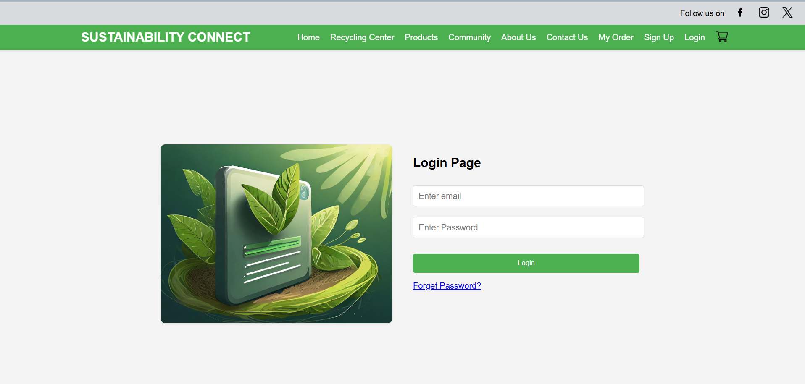
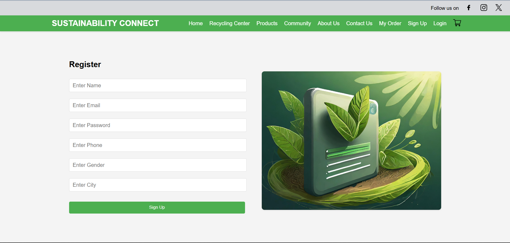
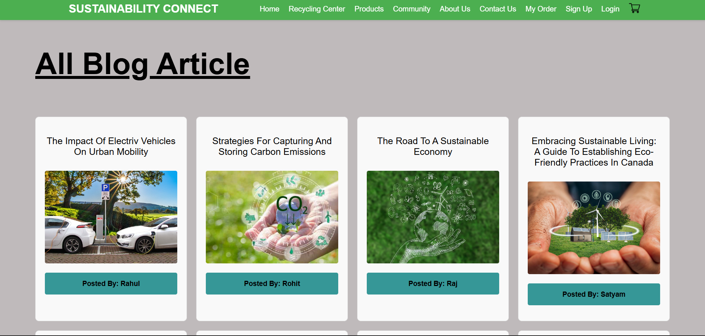
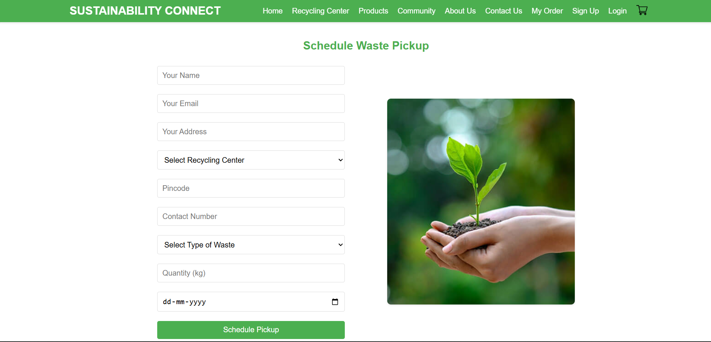

# 🌱 User Module (sus-app)

The **User Module** is the frontend application of the Sustainability Connect platform. It allows users to interact with eco-friendly services, manage waste responsibly, and stay informed about sustainable practices.

---

## 🚀 Features

* 🔐 **Authentication**

  * User Login & Signup
  * Secure access to personalized features

* 🛍️ **Explore Eco-Friendly Products**

  * Browse sustainable and environmentally friendly products
  * Promote conscious consumption

* ♻️ **Schedule Waste Pickup**

  * Book pickup for recyclable waste
  * Select preferred recycling center
  * Track pickup status

* 📰 **Sustainability Blogs**

  * Read blogs on eco-friendly practices
  * Learn tips for reducing environmental impact

---

## 🛠️ Tech Stack

* **Frontend:** React.js
* **Styling:** CSS / Tailwind (if used)
* **API Integration:** REST APIs (Node.js backend)

---

## 📂 Folder Structure (Simplified)

```id="8kgl0m"
sus-app/
│── src/
│   ├── components/
│   ├── pages/
│   ├── services/
│   └── App.jsx
│── public/
│── package.json
```

---

## ⚙️ Getting Started

### 1. Clone the repository

```bash id="6zqz3f"
git clone https://github.com/AnujRaghuwanshi/Sustainability-connect.git
cd sus-app
```

### 2. Install dependencies

```bash id="v9rjdp"
npm install
```

### 3. Run the app

```bash id="y2e1z6"
npm start
```

---

## 🔗 Backend Dependency

This module connects to the backend service:

* `sus-app-backend` (Node.js + Express)

Make sure the backend server is running before using features like pickup scheduling.

---

## 🎯 Purpose

The goal of this module is to:

* Encourage sustainable habits 🌍
* Simplify waste management ♻️
* Educate users through content 📚

---

## 👨‍💻 Author

**[Anuj Raghuwanshi](https://github.com/AnujRaghuwanshi)**

---

## 📸 Screenshots




